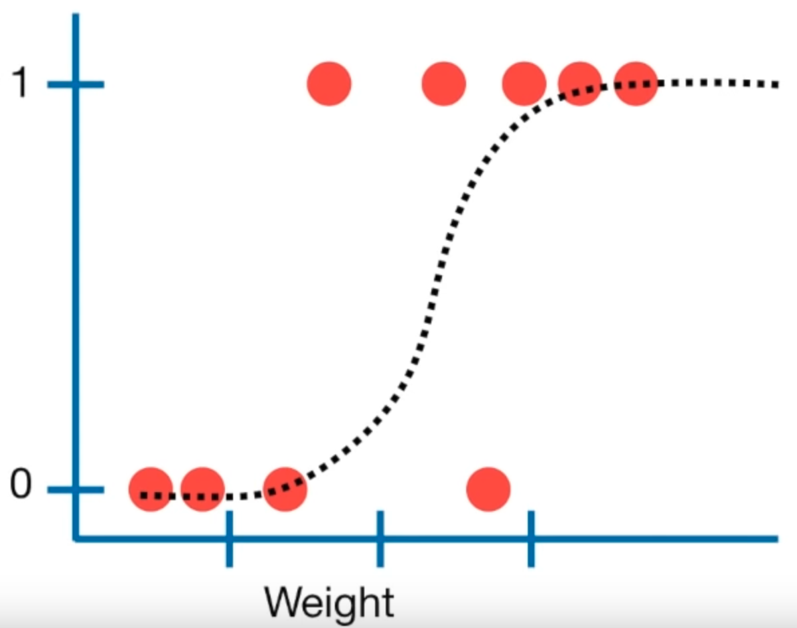

# Logistic Regression {#logistic-regression}

```{r include=FALSE}
library(tidyverse)
library(ISLR2)
```

## TL;DR

What it does
: Models the *probability* that an observation falls into one of two categories

When to do it
: When you are trying to predict a categorical variable with two possible outcomes, like true/false, instead of something continuous like in linear regression

How to do it
: With the `glm()` function, specifying `family = "binomial"`

How to assess it
: Look for a significant $p$-value for the predictor, and assess its accuracy against training data

## What it does

Logistic regression is used to make a prediction about whether an observation falls into one of two categories. This is an alternative to linear regression, which predicts a continuous outcome. A logistic regression results in a model that gives the probability of Y given X. 

(ref:img-lr1) Linear regression plot (source: [StatQuest](https://youtu.be/yIYKR4sgzI8?t=222))

```{r img-lr1, echo=FALSE, fig.cap='(ref:img-lr1)', fig.show='hold', out.width="50%"}

```
## When to do it

As the TL;DR says: When you are trying to predict a categorical variable with two possible outcomes, like true/false, instead of something continuous.

## How to do it

First, it's important to note that logistic regression will give better results when the model is fit using *held out* or *training* data, and then tested against other data, to help avoid overfitting. It is not required, but it's recommended where possible.

First, before that, fit a model using glm, making sure in this case that we have a categorical value to test for:

```{r}
data(Boston)
boston <- Boston %>%
  mutate(
    # Create the categorical crim_above_med response variable
    crim_above_med = as.factor(ifelse(crim > median(crim), "Yes", "No")),
    # Also make a numeric version of crim_above_med for the plot
    crim_above_med_num = ifelse(crim > median(crim), 1, 0)
  )
boston.fits <- glm(crim_above_med ~ nox, data = boston, family = binomial)
summary(boston.fits)
```

We can see the that $p$ value for the `nox` variable is nearly 0, suggesting a strong association between `nox` and `crim_above_med`.

Now split the data into training and test sets, using, say, 80% of the data for training:

```{r}
set.seed(1235)
boston.training <- rep(FALSE, nrow(boston))
boston.training[sample(nrow(boston), nrow(boston) * 0.8)] <- TRUE
boston.test <- !boston.training
```

Fit the above model to the training data:

```{r}
boston.fits <-
  glm(
    crim_above_med ~ nox,
    data = boston,
    subset = boston.training,
    family = binomial
  )
```

And use the fit to predict the test data with `predict()`:

```{r}
boston.probs <- predict(boston.fits, boston[boston.test,], type = "response")
```

## How to assess it

Assess the accuracy of the predictions by building a confusion matrix, using the same values ("No" and "Yes" in this case) as contained in the outcome variable we want to predict:

```{r}
boston.pred <- rep("No", sum(boston.test))
boston.pred[boston.probs > 0.5] <- "Yes"
table(boston.pred, boston[boston.test,]$crim_above_med)
```

The above table shows that the model correctly predicted `crim_above_med` from `nox` 85 times out of 102, with 5 false positives and 12 false negatives. The accuracy of the model can be computed via the `mean()` of how often the predictions match the test data, a neat trick:

```{r}
mean(boston.pred == boston[boston.test,]$crim_above_med)
```

The regression can be plotted with `ggplot2` and the `stat_smooth()` function, utilizing the `glm` method, like so:

```{r}
ggplot(boston, aes(x = nox, y = crim_above_med_num)) +
  geom_point(alpha = .5) +
  stat_smooth(
    method = "glm",
    formula = y ~ x,
    se = FALSE,
    method.args = list(family = binomial),
    col = "red",
    lty = 2
  )
```

This shows that an observation with a `nox` value of 0.6 would have around a 90% probability of `crim_above_med` being true, or 1, while an observation with a `nox` value of 0.5 would only have around a 25% probability of `crim_above_med` being true.

## Where to learn more

- Chapter 4 - 4.4 in @ISLR
- [StatQuest: Logistic Regression](https://www.youtube.com/watch?v=yIYKR4sgzI8)

## Notes

Like with linear regression, the "multiple" flavor of logistic regression works much the same way, with the specification of additional predictors in the formula, and so doesn't really warrant a whole chapter of its own. The selection of variables requires some effort, and is addressed under [best subser selection](#best_subset_selection).
