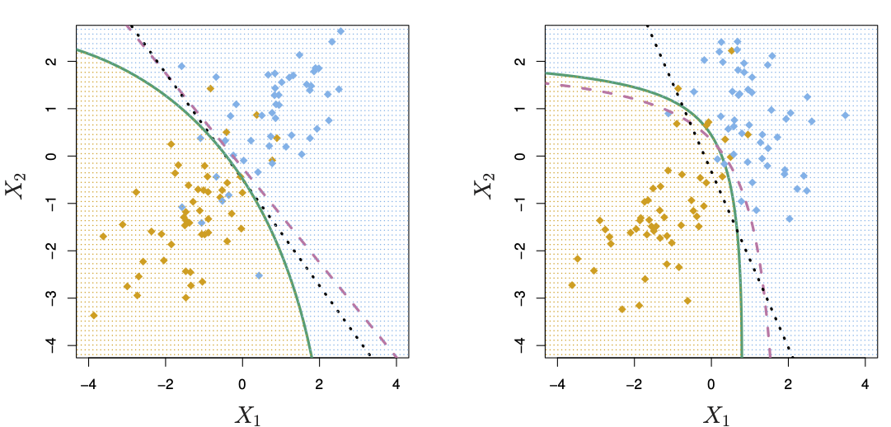

# Quadratic Discriminant Analysis {#quadratic-discriminant-analysis}

```{r include=FALSE}
library(tidyverse)
library(ISLR2)
library(MASS)
```

## TL;DR

What it does
: Assigns observations to categories like [linear discriminant analysis](#linear-discriminant-analysis), but with a more flexible / curved boundary rather than a straight line

When to do it
: When [linear discriminant analysis](#linear-discriminant-analysis) isn't giving good enough results (esp. if the dataset is very large)

How to do it
: With the `qda()` function from the [MASS](https://cran.r-project.org/web/packages/MASS/index.html) library, using training and testing sets 

How to assess it
: Assess the accuracy of the predictions on the test set after training

## What it does

Just like [linear discriminant analysis](#linear-discriminant-analysis), quadratic discriminant analysis attempts to separate observations into two or more classes or categories, but it allows for a curved boundary between the classes. Which approach gives better results depends on the shape of the Bayes decision boundary. The following figure from @ISLR shows the two approaches:

(ref:img-slr49) LDA and QDA plots (source: @ISLR, p. 154)

```{r img-slr49, echo=FALSE, fig.cap='(ref:img-slr49)', fig.show='hold'}

```

The purple dashed line in both diagrams shows the Bayes decision boundary. The LDA line in the left plot shows this class separation line as straight; the QDA line on the right is curved.

## When to do it

Use QDA when the linear separation of [linear discriminant analysis](#linear-discriminant-analysis) isn't giving good enough results, and you think a curved (or quadratic) line might fit better.

## How to do it

Exactly like [linear discriminant analysis](#linear-discriminant-analysis), except for the `qda()` call instead of `lda()`. Train the model on training data, assess it against test data.

```{r}
data(Boston)
boston <- Boston %>%
  mutate(
    # Create the categorical crim_above_med response variable
    crim_above_med = as.factor(ifelse(crim > median(crim), "Yes", "No")),
  )
```

We again split the data into training and test sets:

```{r}
set.seed(1235)
boston.training <- rep(FALSE, nrow(boston))
boston.training[sample(nrow(boston), nrow(boston) * 0.8)] <- TRUE
boston.test <- !boston.training
```

and call `qda()` on the training data:

```{r}
boston_qda.fits <-
  qda(
    crim_above_med ~ nox,
    data = boston,
    subset = boston.training,
  )
```

## How to assess it

As with `lda()`, the resulting fit can be directly examined:

```{r}
boston_qda.fits
```

Note that in this example, the `Prior probabilities of groups` and `Group means` assessments are identical to those from `lda()`. There is no linear discriminant coefficient, because this is not a linear discriminant! The rest of the output is identical.

We then call `predict` on the QDA fit, to predict the `crim_above_med` variable from `nox`:

```{r}
boston_qda.pred <- predict(boston_qda.fits, boston[boston.test, ])
table(boston_qda.pred$class, boston[boston.test, ]$crim_above_med)
```

In this example, just like LDA, QDA made the correct categorization 87 times out of 102, with 3 false positives and 12 false negatives. And again, we can compute the prediction accuracy by the mean of the correct-to-wrong guesses:

```{r}
mean(boston_qda.pred$class == boston[boston.test, ]$crim_above_med)
```

In this case, QDA offered no increase in prediction accuracy over LDA, so there is no reason to prefer it (although it also performed no poorer).

## Where to learn more

- Chapter 4.4.3 in @ISLR

