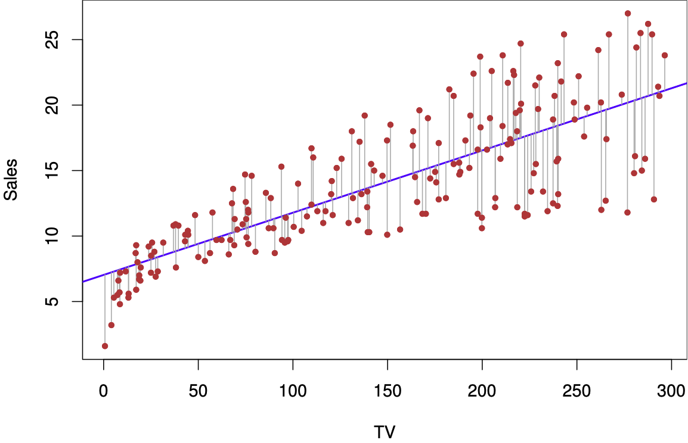

# Simple Linear Regression {#simple-linear-regression}

```{r include=FALSE}
library(tidyverse)
library(MASS)
library(ISLR2)
```

## TL;DR

What it does
: Looks to see how well a single predictor variable predicts an outcome, like *how well do years of education predict salary?*

When to do it
: When you want to see if pretty much the simplest possible model provides enough of an explanation of variance for your purposes

How to do it
: With the `lm()` function, among other ways

How to assess it
: Look for a significant $p$-value for the predictor, and a reasonable $R^2$

Note
: "Linear" does not necessarily mean "straight" in this context; a linear regression line can curve.

## What it does 

Simple linear regression is where it all begins; among the simplest of all of the regression techniques in analysis, which attempts to estimate a slope and an intercept line for a set of observations using a single predictor variable $X$ and an output variable $Y$. It uses ordinary least squares (OLS) to build its model, looking for the line through the mean of $X$ and $Y$ that has the smallest sum of squares between the predicted and observed values.

(ref:img-slr1) Simple linear regression plot (source: @ISLR, p. 62)

```{r img-slr1, echo=FALSE, fig.cap='(ref:img-slr1)', fig.show='hold'}

```

The figure above shows a plot of a simple linear regression, attempting to use the variable `TV` to predict `Sales.` The blue line is the line defined by the regression with its $Y$ intercept and slope; the red dots are the actual observations of `Sales` for each measure of the predictor `TV` on the $X$ axis. The thin blue lines are the error in the prediction.

## When to do it

It is a simple first step for looking at data to see if there is an easy single-variable model that does a reasonable job predicting outcomes using one predictor variable. Sometimes, it can be good enough! It has the advantage of being easy to execute, to understand and to communicate, and the value of these factors should not be underestimated. Communicating with non-specialists is an important aspect of a data scientist's job.

Linear regression requires a dataset with a continuous outcome variable; it is easiest and most effective if the predictor variable is also numeric, whether continuous or discrete. It is possible to do linear regression with non-numeric predictors, such as true/false or ordered responses, by converting the predictors to a numeric scale.

## How to do it

This example from @ISLR shows a simple linear regression of **medv** onto **lstat**, attempting to predict median housing prices from percentage of "lower-status" population in the Boston data set from the late 1970s.

```{r message=FALSE, warning=FALSE}
lm.fit <- lm(medv ~ lstat, data = Boston)
plot(Boston$lstat, Boston$medv)
abline(lm.fit, lwd = 3, col = "red")
```

The results of the regression are stored in the output of `lm()`, and may be viewed with `summary()`:

```{r}
summary(lm.fit)
```

## How to assess it

The output contains a lot of information, but the key points are:

- `Adjusted R-squared`: 0.5432 is the percentage of the variation in the model that is explained by the fit's prediction, compared to just looking at how much the observations vary from their own average with no predictor variable.
- `Residual standard error`: 6.216 is "the average amount that the response will deviate from the true regression line", or the standard deviation of the error. In this case, since the unit of `medv` is in thousands of dollars, it means the average prediction will be off by $6,216.
- `p-value`: < 2.2e-16 (basically zero) means that the model is (very) statistically significant, with a near-zero percent chance that the data in this set could have resulted from a random draw from the (unknown) population if there were no relationship between `medv` and `lstat`.
- `Estimated intercept` of 34.55 is the $Y$ intercept on the graph, or the estimated value of `medv` when `lstat` is zero.
- `Estimated (lstat)`: -0.95 is the estimated coefficient of `lstat`, or the amount that `medv` changes by for each unit change in `lstat`.

The intercept and coefficient are $\beta_0$ and $\beta_1$, respectively, of the linear regression formula

$$\hat{y} = \hat{\beta_0} + \hat{\beta_1}x$$
Substituting the coefficients and variables, we transform this to:

$$\widehat{\text{medv}} = 34.55 - 0.95 \times \text{lstat}$$

The low p-value shows that there is (almost) definitely a relationship between `medv` and `lstat`, but the $R^2$ of 0.54 shows that the model only explains slightly more than half of the variation in the data. It's not a bad start, but we would probably want to find a model that explains more of it.

## Where to learn more

- Chapter 3 - 3.1 in @ISLR
- [StatQuest: Linear Regression](https://www.youtube.com/watch?v=nk2CQITm_eo) - this goes into good depth on the meaning of the $F$ statistic as well, and how it used to calculate the $p$ value.

## Notes

You can also do a scatterplot in ggplot2 and add a regression line with `geom_smooth()`; it doesn't show the coefficients or other output information, but it gives a quick visual that's a little prettier than the base R plot:

```{r message=FALSE, warning=FALSE}
ggplot(data = Boston, aes(x = lstat, y = medv)) +
  geom_point(alpha = 0.5) +
  geom_smooth(method = "lm", formula = y ~ x) +
  geom_hline(yintercept = mean(Boston$medv), linetype = "dashed", color = "red") +
  geom_vline(xintercept = mean(Boston$lstat), linetype = "dashed", color = "darkgreen") +
  theme_minimal()
```

The means of `lstat` and `medv` are shown with dashed red and green lines, showing that the regression line goes through the center of the data.
